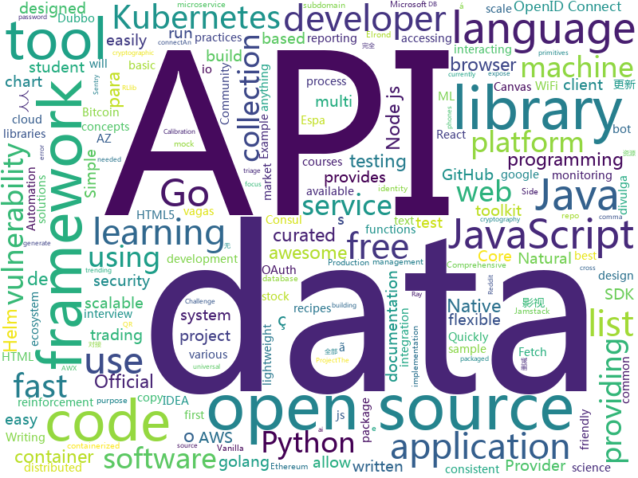

# 2021-02-11
See what the GitHub community is most excited about.

## python
+ [Reddit-Stock-Trends](https://github.com/iam-abbas/Reddit-Stock-Trends)(**273 stars today**): Fetch currently trending stocks on Reddit
+ [YYeTsBot](https://github.com/tgbot-collection/YYeTsBot)(**210 stars today**): 🎬人人影视bot，完全对接人人影视全部无删减资源
+ [awx](https://github.com/ansible/awx)(**27 stars today**): AWX Project
+ [calib_challenge](https://github.com/commaai/calib_challenge)(**5 stars today**): The comma.ai Calibration Challenge!
+ [sentry](https://github.com/getsentry/sentry)(**9 stars today**): Sentry is cross-platform application monitoring, with a focus on error reporting.
+ [cryptography](https://github.com/pyca/cryptography)(**22 stars today**): cryptography is a package designed to expose cryptographic primitives and recipes to Python developers.
+ [osv](https://github.com/google/osv)(**23 stars today**): Open source vulnerability DB and triage service.
+ [wifi-password](https://github.com/sdushantha/wifi-password)(**42 stars today**): Quickly fetch your WiFi password and if needed, generate a QR code of your WiFi to allow phones to easily connect
+ [ray](https://github.com/ray-project/ray)(**16 stars today**): An open source framework that provides a simple, universal API for building distributed applications. Ray is packaged with RLlib, a scalable reinforcement learning library, and Tune, a scalable hyperparameter tuning library.
+ [doccano](https://github.com/doccano/doccano)(**21 stars today**): Open source text annotation tool for machine learning practitioner.
+ [black](https://github.com/psf/black)(**26 stars today**): The uncompromising Python code formatter
+ [transformers](https://github.com/huggingface/transformers)(**50 stars today**): 🤗Transformers: State-of-the-art Natural Language Processing for Pytorch and TensorFlow 2.0.
+ [python-docs-samples](https://github.com/GoogleCloudPlatform/python-docs-samples)(**3 stars today**): Code samples used on cloud.google.com
+ [pororo](https://github.com/kakaobrain/pororo)(**19 stars today**): PORORO: Platform Of neuRal mOdels for natuRal language prOcessing
+ [SeaLion](https://github.com/anish-lakkapragada/SeaLion)(**33 stars today**): The first machine learning framework that encourages learning ML concepts instead of memorizing class functions.
+ [posthog](https://github.com/PostHog/posthog)(**4 stars today**): 🦔PostHog is developer-friendly, open-source product analytics.
+ [freqtrade](https://github.com/freqtrade/freqtrade)(**90 stars today**): Free, open source crypto trading bot
+ [sense](https://github.com/TwentyBN/sense)(**22 stars today**): Enhance your application with the ability to see and interact with humans using any RGB camera.
+ [CompilerGym](https://github.com/facebookresearch/CompilerGym)(**19 stars today**): A reinforcement learning toolkit for compiler optimizations
+ [MeInGame](https://github.com/FuxiCV/MeInGame)(**26 stars today**): MeInGame: Create a Game Character Face from a Single Portrait, AAAI 2021
+ [bbs](https://github.com/net4people/bbs)(**12 stars today**): Forum for discussing Internet censorship circumvention
+ [public-apis](https://github.com/public-apis/public-apis)(**80 stars today**): A collective list of free APIs for use in software and web development.
+ [pandas](https://github.com/pandas-dev/pandas)(**17 stars today**): Flexible and powerful data analysis / manipulation library for Python, providing labeled data structures similar to R data.frame objects, statistical functions, and much more
+ [system-design-primer](https://github.com/donnemartin/system-design-primer)(**73 stars today**): Learn how to design large-scale systems. Prep for the system design interview. Includes Anki flashcards.
+ [kedro](https://github.com/quantumblacklabs/kedro)(**9 stars today**): A Python framework for creating reproducible, maintainable and modular data science code.

## java
+ [mlkit](https://github.com/googlesamples/mlkit)(**37 stars today**): A collection of sample apps to demonstrate how to use Google's ML Kit APIs on Android and iOS
+ [JCSprout](https://github.com/crossoverJie/JCSprout)(**12 stars today**): 👨‍🎓Java Core Sprout : basic, concurrent, algorithm
+ [Ehviewer_CN_SXJ](https://github.com/xiaojieonly/Ehviewer_CN_SXJ)(**5 stars today**): 因为ehviewer近一年多没更新了，所以想copy过来试着更新下
+ [quarkus](https://github.com/quarkusio/quarkus)(**10 stars today**): Quarkus: Supersonic Subatomic Java.
+ [XChange](https://github.com/knowm/XChange)(**4 stars today**): XChange is a Java library providing a streamlined API for interacting with 60+ Bitcoin and Altcoin exchanges providing a consistent interface for trading and accessing market data.
+ [zeebe](https://github.com/zeebe-io/zeebe)(**2 stars today**): Distributed Workflow Engine for Microservices Orchestration
+ [camel](https://github.com/apache/camel)(**1 stars today**): Apache Camel is an open source integration framework that empowers you to quickly and easily integrate various systems consuming or producing data.
+ [wiremock](https://github.com/tomakehurst/wiremock)(**0 stars today**): A tool for mocking HTTP services
+ [bazel](https://github.com/bazelbuild/bazel)(**6 stars today**): a fast, scalable, multi-language and extensible build system
+ [AppAuth-Android](https://github.com/openid/AppAuth-Android)(**2 stars today**): Android client SDK for communicating with OAuth 2.0 and OpenID Connect providers.
+ [spotless](https://github.com/diffplug/spotless)(**2 stars today**): Keep your code spotless
+ [HikariCP](https://github.com/brettwooldridge/HikariCP)(**2 stars today**): 光 HikariCP・A solid, high-performance, JDBC connection pool at last.
+ [aws-lambda-developer-guide](https://github.com/awsdocs/aws-lambda-developer-guide)(**1 stars today**): The AWS Lambda Developer Guide
+ [karate](https://github.com/intuit/karate)(**5 stars today**): Test Automation Made Simple
+ [hazelcast](https://github.com/hazelcast/hazelcast)(**0 stars today**): Open Source In-Memory Data Grid
+ [CtCI-6th-Edition](https://github.com/careercup/CtCI-6th-Edition)(**6 stars today**): Cracking the Coding Interview 6th Ed. Solutions
+ [guava](https://github.com/google/guava)(**10 stars today**): Google core libraries for Java
+ [ghidra](https://github.com/NationalSecurityAgency/ghidra)(**24 stars today**): Ghidra is a software reverse engineering (SRE) framework
+ [strimzi-kafka-operator](https://github.com/strimzi/strimzi-kafka-operator)(**2 stars today**): Apache Kafka running on Kubernetes
+ [lombok](https://github.com/rzwitserloot/lombok)(**2 stars today**): Very spicy additions to the Java programming language.
+ [testcontainers-java](https://github.com/testcontainers/testcontainers-java)(**4 stars today**): Testcontainers is a Java library that supports JUnit tests, providing lightweight, throwaway instances of common databases, Selenium web browsers, or anything else that can run in a Docker container.
+ [allure2](https://github.com/allure-framework/allure2)(**3 stars today**): Allure Framework is a flexible lightweight multi-language test reporting tool. It provides clear graphical reports and allows everyone involved in the development process extract maximum of information from everyday testing process.
+ [selenium](https://github.com/SeleniumHQ/selenium)(**7 stars today**): A browser automation framework and ecosystem.
+ [JavaSpringBootSamples](https://github.com/ipipman/JavaSpringBootSamples)(**9 stars today**): SpringBoot、Dubbo、SpringCloud的各种集成例子：Atomikos、gRPC、Thrift、Seata、ShardingSphere、Dubbo、Hmily、Nacos、Consul、Ribbon、Jedis、Lettuce、Redisson等框架
+ [jacoco](https://github.com/jacoco/jacoco)(**1 stars today**): 🔬Java Code Coverage Library

## unknown
+ [1s](https://github.com/justjavac/1s)(**92 stars today**): 天若有情天亦老，我为网站加一秒
+ [awesome-libra](https://github.com/reed-hong/awesome-libra)(**217 stars today**): A Curated List of Awesome Facebook Libra Resources
+ [lolMiner-releases](https://github.com/Lolliedieb/lolMiner-releases)(**13 stars today**): 
+ [Free-Certifications](https://github.com/cloudcommunity/Free-Certifications)(**130 stars today**): Curated list of free courses & certifications
+ [selling-partner-api-docs](https://github.com/amzn/selling-partner-api-docs)(**3 stars today**): This repository contains documentation for developers to use to call Selling Partner APIs.
+ [market-toolkit](https://github.com/ckz8780/market-toolkit)(**11 stars today**): A collection of stock market resources and tools
+ [idiomatic.js](https://github.com/rwaldron/idiomatic.js)(**4 stars today**): Principles of Writing Consistent, Idiomatic JavaScript
+ [Nmap](https://github.com/Y000o/Nmap)(**10 stars today**): 
+ [modern-js-cheatsheet](https://github.com/mbeaudru/modern-js-cheatsheet)(**14 stars today**): Cheatsheet for the JavaScript knowledge you will frequently encounter in modern projects.
+ [free-programming-books](https://github.com/EbookFoundation/free-programming-books)(**158 stars today**): 📚Freely available programming books
+ [awesome-react](https://github.com/enaqx/awesome-react)(**21 stars today**): A collection of awesome things regarding React ecosystem
+ [AZ-900T0x-MicrosoftAzureFundamentals](https://github.com/MicrosoftLearning/AZ-900T0x-MicrosoftAzureFundamentals)(**1 stars today**): Microsoft Azure Fundamentals - AZ-900T00 and AZ-900T01
+ [vagas](https://github.com/frontendbr/vagas)(**8 stars today**): 🔬Espaço para divulgação de vagas para front-enders.
+ [awesome-actions](https://github.com/sdras/awesome-actions)(**13 stars today**): A curated list of awesome actions to use on GitHub
+ [1](https://github.com/1XDJ/1)(**0 stars today**): 小妲己回家页
+ [Testnet4-Challenges](https://github.com/Concordium/Testnet4-Challenges)(**0 stars today**): 
+ [educative.io_courses](https://github.com/merry75/educative.io_courses)(**3 stars today**): this is downloadings of all educative.io free student subscription courses as pdf from GitHub student pack
+ [vagas](https://github.com/backend-br/vagas)(**6 stars today**): ✌️Espaço para divulgação de vagas para backenders
+ [intellij-community](https://github.com/JetBrains/intellij-community)(**6 stars today**): IntelliJ IDEA Community Edition & IntelliJ Platform
+ [Research-Internships-for-Undergraduates](https://github.com/himahuja/Research-Internships-for-Undergraduates)(**1 stars today**): List of Research Internships for Undergraduate Students
+ [Android-Penetration-Testing](https://github.com/Ignitetechnologies/Android-Penetration-Testing)(**1 stars today**): 
+ [OnJava8](https://github.com/LingCoder/OnJava8)(**14 stars today**): 《On Java 8》中文版
+ [binance-spot-api-docs](https://github.com/binance/binance-spot-api-docs)(**11 stars today**): Official Documentation for the Binance Spot APIs and Streams
+ [awesome-java](https://github.com/akullpp/awesome-java)(**3 stars today**): A curated list of awesome frameworks, libraries and software for the Java programming language.
+ [kubernetes-network-policy-recipes](https://github.com/ahmetb/kubernetes-network-policy-recipes)(**4 stars today**): Example recipes for Kubernetes Network Policies that you can just copy paste

## javascript
+ [nodebestpractices](https://github.com/goldbergyoni/nodebestpractices)(**195 stars today**): ✅The Node.js best practices list (February 2021)
+ [clean-code-javascript](https://github.com/ryanmcdermott/clean-code-javascript)(**184 stars today**): 🛁Clean Code concepts adapted for JavaScript
+ [gaze-detection](https://github.com/charliegerard/gaze-detection)(**105 stars today**): 👀Use machine learning in JavaScript to detect eye movements and build gaze-controlled experiences.
+ [Web-Dev-For-Beginners](https://github.com/microsoft/Web-Dev-For-Beginners)(**177 stars today**): 24 Lessons, 12 Weeks, Get Started as a Web Developer
+ [cube.js](https://github.com/cube-js/cube.js)(**17 stars today**): 📊Cube.js — Open-Source Analytical API Platform
+ [next.js](https://github.com/vercel/next.js)(**48 stars today**): The React Framework
+ [react-native-reanimated](https://github.com/software-mansion/react-native-reanimated)(**6 stars today**): React Native's Animated library reimplemented
+ [discord-open-source](https://github.com/discord/discord-open-source)(**25 stars today**): List of open source communities living on Discord
+ [turbo-rails](https://github.com/hotwired/turbo-rails)(**6 stars today**): Use Turbo in your Ruby on Rails app
+ [iptv](https://github.com/iptv-org/iptv)(**281 stars today**): Collection of 5000+ publicly available IPTV channels from all over the world
+ [objection.js](https://github.com/Vincit/objection.js)(**5 stars today**): An SQL-friendly ORM for Node.js
+ [d3](https://github.com/d3/d3)(**22 stars today**): Bring data to life with SVG, Canvas and HTML.📊📈🎉
+ [strapi](https://github.com/strapi/strapi)(**36 stars today**): 🚀Open source Node.js Headless CMS to easily build customisable APIs
+ [cypress](https://github.com/cypress-io/cypress)(**25 stars today**): Fast, easy and reliable testing for anything that runs in a browser.
+ [Chart.js](https://github.com/chartjs/Chart.js)(**17 stars today**): Simple HTML5 Charts using the <canvas> tag
+ [cli](https://github.com/npm/cli)(**6 stars today**): the package manager for JavaScript
+ [Scripts](https://github.com/Sunert/Scripts)(**14 stars today**): 
+ [slader-extension](https://github.com/lebr0nli/slader-extension)(**4 stars today**): Bypass Slader's 5 solutions limit per month to college books and remove the paywall about how many solutions left
+ [javascript-testing-best-practices](https://github.com/goldbergyoni/javascript-testing-best-practices)(**11 stars today**): 📗🌐🚢Comprehensive and exhaustive JavaScript & Node.js testing best practices (January 2021)
+ [Rocket.Chat.ReactNative](https://github.com/RocketChat/Rocket.Chat.ReactNative)(**1 stars today**): Rocket.Chat mobile clients
+ [react-native-calendars](https://github.com/wix/react-native-calendars)(**3 stars today**): React Native Calendar Components🗓️📆
+ [gridsome](https://github.com/gridsome/gridsome)(**19 stars today**): ⚡️The Jamstack framework for Vue.js
+ [awesome-mac](https://github.com/jaywcjlove/awesome-mac)(**13 stars today**):  Now we have become very big, Different from the original idea. Collect premium software in various categories.
+ [redwood](https://github.com/redwoodjs/redwood)(**17 stars today**): Bringing full-stack to the Jamstack.
+ [pino](https://github.com/pinojs/pino)(**15 stars today**): 🌲super fast, all natural json logger🌲

## html
+ [Licensing](https://github.com/AaronDinnage/Licensing)(**8 stars today**): Microsoft 365 licensing diagrams
+ [kubespray](https://github.com/kubernetes-sigs/kubespray)(**5 stars today**): Deploy a Production Ready Kubernetes Cluster
+ [argo-helm](https://github.com/argoproj/argo-helm)(**0 stars today**): ArgoProj Helm Charts
+ [wpt](https://github.com/web-platform-tests/wpt)(**0 stars today**): Test suites for Web platform specs — including WHATWG, W3C, and others
+ [zenbot](https://github.com/DeviaVir/zenbot)(**9 stars today**): Zenbot is a command-line cryptocurrency trading bot using Node.js and MongoDB.
+ [bitaddress.org](https://github.com/pointbiz/bitaddress.org)(**2 stars today**): JavaScript Client-Side Bitcoin Wallet Generator
+ [amundsen](https://github.com/amundsen-io/amundsen)(**4 stars today**): Amundsen is a metadata driven application for improving the productivity of data analysts, data scientists and engineers when interacting with data.
+ [eks-charts](https://github.com/aws/eks-charts)(**0 stars today**): Amazon EKS Helm chart repository
+ [helm-charts](https://github.com/prometheus-community/helm-charts)(**5 stars today**): Prometheus community Helm charts
+ [Kubernetes_public](https://github.com/kunchalavikram1427/Kubernetes_public)(**0 stars today**): Public repo of Kubernetes
+ [supercookie](https://github.com/jonasstrehle/supercookie)(**240 stars today**): ⚠️Browser fingerprinting via favicon!
+ [free_r_tips](https://github.com/business-science/free_r_tips)(**3 stars today**): Free R-Tips is a FREE Newsletter provided by Business Science. It comes with bite-sized code tutorials every Tuesday.
+ [django-DefectDojo](https://github.com/DefectDojo/django-DefectDojo)(**1 stars today**): DefectDojo is an open-source application vulnerability correlation and security orchestration tool.
+ [tidytuesday](https://github.com/rfordatascience/tidytuesday)(**8 stars today**): Official repo for the #tidytuesday project
+ [ansible-collection-hardening](https://github.com/dev-sec/ansible-collection-hardening)(**2 stars today**): This Ansible collection provides battle tested hardening for Linux, SSH, nginx, MySQL
+ [text-to-handwriting](https://github.com/saurabhdaware/text-to-handwriting)(**23 stars today**): So your teacher asked you to upload written assignments? Hate writing assigments? This tool will help you convert your text to handwriting xD
+ [charts](https://github.com/bitnami/charts)(**5 stars today**): Helm Charts
+ [EIPs](https://github.com/ethereum/EIPs)(**4 stars today**): The Ethereum Improvement Proposal repository
+ [msteams-docs](https://github.com/MicrosoftDocs/msteams-docs)(**1 stars today**): Source for the Microsoft Teams developer platform documentation.
+ [tiny-slider](https://github.com/ganlanyuan/tiny-slider)(**6 stars today**): Vanilla javascript slider for all purposes.
+ [helm-charts](https://github.com/codecentric/helm-charts)(**0 stars today**): A curated set of Helm charts brought to you by codecentric
+ [rellax](https://github.com/dixonandmoe/rellax)(**12 stars today**): Lightweight, vanilla javascript parallax library
+ [web-moderno](https://github.com/cod3rcursos/web-moderno)(**0 stars today**): 
+ [html-css](https://github.com/gustavoguanabara/html-css)(**13 stars today**): Curso de HTML5 e CSS3
+ [Formulario](https://github.com/rafaballerini/Formulario)(**3 stars today**): Página de formulário com HTML e CSS

## go
+ [vault](https://github.com/hashicorp/vault)(**250 stars today**): A tool for secrets management, encryption as a service, and privileged access management
+ [nomad](https://github.com/hashicorp/nomad)(**10 stars today**): Nomad is an easy-to-use, flexible, and performant workload orchestrator that can deploy a mix of microservice, batch, containerized, and non-containerized applications. Nomad is easy to operate and scale and has native Consul and Vault integrations.
+ [kubevirt](https://github.com/kubevirt/kubevirt)(**14 stars today**): Kubernetes Virtualization API and runtime in order to define and manage virtual machines.
+ [learngo](https://github.com/inancgumus/learngo)(**93 stars today**): 1000+ Hand-Crafted Go Examples, Exercises, and Quizzes
+ [elrond-go](https://github.com/ElrondNetwork/elrond-go)(**14 stars today**): ⚡Elrond-GO: The official implementation of the Elrond protocol, written in golang.
+ [trivy](https://github.com/aquasecurity/trivy)(**97 stars today**): A Simple and Comprehensive Vulnerability Scanner for Containers, Suitable for CI
+ [kratos](https://github.com/ory/kratos)(**14 stars today**): Next-gen identity server (think Auth0, Okta, Firebase) with ORY-hardened authentication, MFA, FIDO2, profile management, identity schemas, social sign in, registration, account recovery, service-to-service and IoT auth. Can work as an OAuth2 / OpenID Connect Provider. Golang, headles, API-only - without templating or themeing headaches.
+ [tendermint](https://github.com/tendermint/tendermint)(**4 stars today**): ⟁ Tendermint Core (BFT Consensus) in Go
+ [sorg](https://github.com/brandur/sorg)(**5 stars today**): A Go-based static site generator that compiles brandur.org.
+ [esbuild](https://github.com/evanw/esbuild)(**74 stars today**): An extremely fast JavaScript bundler and minifier
+ [go-sqlmock](https://github.com/DATA-DOG/go-sqlmock)(**4 stars today**): Sql mock driver for golang to test database interactions
+ [subfinder](https://github.com/projectdiscovery/subfinder)(**7 stars today**): Subfinder is a subdomain discovery tool that discovers valid subdomains for websites. Designed as a passive framework to be useful for bug bounties and safe for penetration testing.
+ [kops](https://github.com/kubernetes/kops)(**7 stars today**): Kubernetes Operations (kops) - Production Grade K8s Installation, Upgrades, and Management
+ [testify](https://github.com/stretchr/testify)(**15 stars today**): A toolkit with common assertions and mocks that plays nicely with the standard library
+ [opentelemetry-go](https://github.com/open-telemetry/opentelemetry-go)(**2 stars today**): OpenTelemetry Go API and SDK
+ [go-github](https://github.com/google/go-github)(**3 stars today**): Go library for accessing the GitHub API
+ [httpx](https://github.com/projectdiscovery/httpx)(**5 stars today**): httpx is a fast and multi-purpose HTTP toolkit allow to run multiple probers using retryablehttp library, it is designed to maintain the result reliability with increased threads.
+ [moby](https://github.com/moby/moby)(**14 stars today**): Moby Project - a collaborative project for the container ecosystem to assemble container-based systems
+ [hydra](https://github.com/ory/hydra)(**4 stars today**): OpenID Certified™ OpenID Connect and OAuth Provider written in Go - cloud native, security-first, open source API security for your infrastructure. SDKs for any language. Compatible with MITREid.
+ [nuclei](https://github.com/projectdiscovery/nuclei)(**8 stars today**): Nuclei is a fast tool for configurable targeted vulnerability scanning based on templates offering massive extensibility and ease of use.
+ [go-ethereum](https://github.com/ethereum/go-ethereum)(**30 stars today**): Official Go implementation of the Ethereum protocol
+ [buildkit](https://github.com/moby/buildkit)(**1 stars today**): concurrent, cache-efficient, and Dockerfile-agnostic builder toolkit
+ [gitea](https://github.com/go-gitea/gitea)(**16 stars today**): Git with a cup of tea, painless self-hosted git service
+ [iamlive](https://github.com/iann0036/iamlive)(**53 stars today**): Generate a basic IAM policy from AWS client-side monitoring (CSM)
+ [aws-sdk-go](https://github.com/aws/aws-sdk-go)(**3 stars today**): AWS SDK for the Go programming language.

## WordCloud

